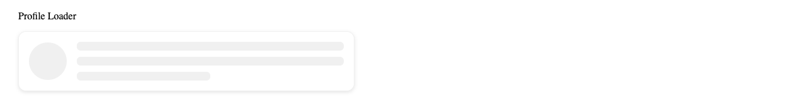

# @anzflex/ngx-skeleton-loader


# Installation

```
npm install --save @anzflex/ngx-skeleton-loader
```

# Version Compatibility

Loader is compatible with Angular 19.x and newer

## Usage

To use the `@anzflex/ngx-skeleton-loader` component in your Angular application, follow these steps:

### Step 1: Import the Component
import `@anzflex/ngx-skeleton-loader` components where you want to use them
```ts
//app.ts
import { NgxSkeletonLoader, NgxTableLoader, NgxProfileLoader, NgxCardLoader } from '@anzflex/ngx-skeleton-loader';

@Component({
  selector: 'app-root',
  imports: [NgxSkeletonLoader, NgxTableLoader, NgxProfileLoader, NgxCardLoader],
  templateUrl: './app.html',
  styleUrl: './app.scss'
})
export class App {
  //... your component logics here
}
```

```html
<!-- app.html -->
    <div class="container">
   <div style="margin-top: 30px;margin-bottom:15px;">Shapes</div>
 <div class="shapes">
   <ngx-skeleton-loader height="100px" width="100px" color="#dedede" radius="50%" />
  <ngx-skeleton-loader height="100px" width="100px" color="#dedede" radius="0%" />
  <ngx-skeleton-loader height="100px" width="100px" color="#dedede" radius="20px" />
  <div>
    <ngx-skeleton-loader height="15px" width="300px"  radius="10px" [margin]="{bottom: '10px'}" />
    <ngx-skeleton-loader height="15px" width="300px"  radius="10px" [margin]="{bottom: '10px'}" />
    <ngx-skeleton-loader height="15px" width="300px"  radius="10px" [margin]="{bottom: '10px'}" />
    <ngx-skeleton-loader height="15px" width="200px"  radius="10px" [margin]="{bottom: '10px'}" />
  </div>
 </div>
  <div style="margin-top: 30px;margin-bottom:15px;">Table Loader</div>
  <ngx-table-skeleton-loader />
  <div style="margin-top: 30px;margin-bottom:15px;">Profile Loader</div>
  <ngx-profile-skeleton-loader width="500px" radius="12px" />
  <div style="margin-top: 30px;margin-bottom:15px;">Card Loader</div>
  <ngx-card-skeleton-loader width="40%" imageHeight="300px" />
</div>

```
## Custom Shapes Preview

```html 
    <div class="shapes">
   <ngx-skeleton-loader height="100px" width="100px" color="#dedede" radius="50%" />
  <ngx-skeleton-loader height="100px" width="100px" color="#dedede" radius="0%" />
  <ngx-skeleton-loader height="100px" width="100px" color="#dedede" radius="20px" />
  <div>
    <ngx-skeleton-loader height="15px" width="300px"  radius="10px" [margin]="{bottom: '10px'}" />
    <ngx-skeleton-loader height="15px" width="300px"  radius="10px" [margin]="{bottom: '10px'}" />
    <ngx-skeleton-loader height="15px" width="300px"  radius="10px" [margin]="{bottom: '10px'}" />
    <ngx-skeleton-loader height="15px" width="200px"  radius="10px" [margin]="{bottom: '10px'}" />
  </div>
 </div>
```

## Table Skeleton Loader Preview

```html 
    <ngx-table-skeleton-loader />
```


## Card Skeleton Loader Preview

```html 
    <ngx-card-skeleton-loader width="40%" imageHeight="300px" />
```

## Profile Skeleton Loader Preview

```html 
   <ngx-profile-skeleton-loader width="500px" radius="12px" />
```

